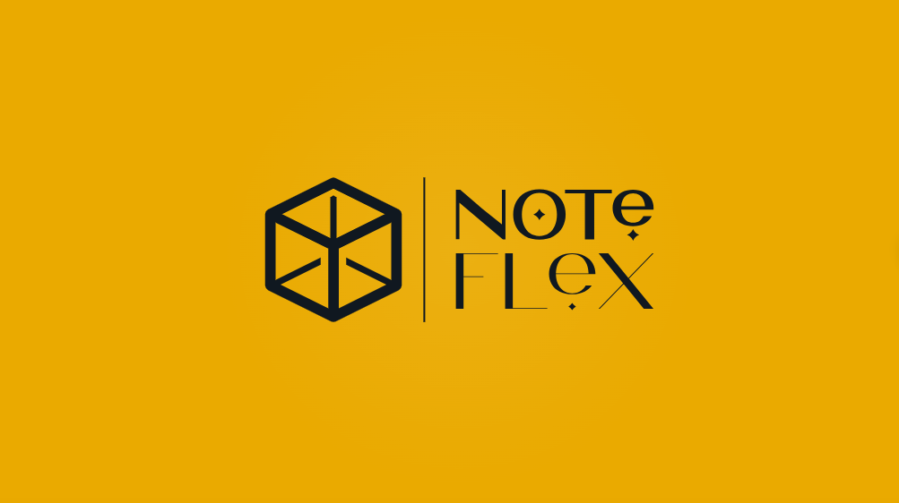

# NoteFlex Application

NoteFlex is the backend part of the NoteFlex application, which includes registration and authentication
capabilities (based on tokens), as well as the ability to work with notes (creating notes, retrieving all
notes, retrieving notes by identifier, updating notes by identifier, deleting notes by identifier) and tasks
(creating tasks, retrieving all tasks, retrieving all completed tasks, retrieving all active tasks, retrieving
tasks by identifier, updating tasks by identifier, deleting tasks by identifier). Technologies such as
JavaScript, MySQL, Express, and Swagger (for API documentation) were used to develop the backend part of
this application. Mocha, Should, and Supertest were used for unit testing.